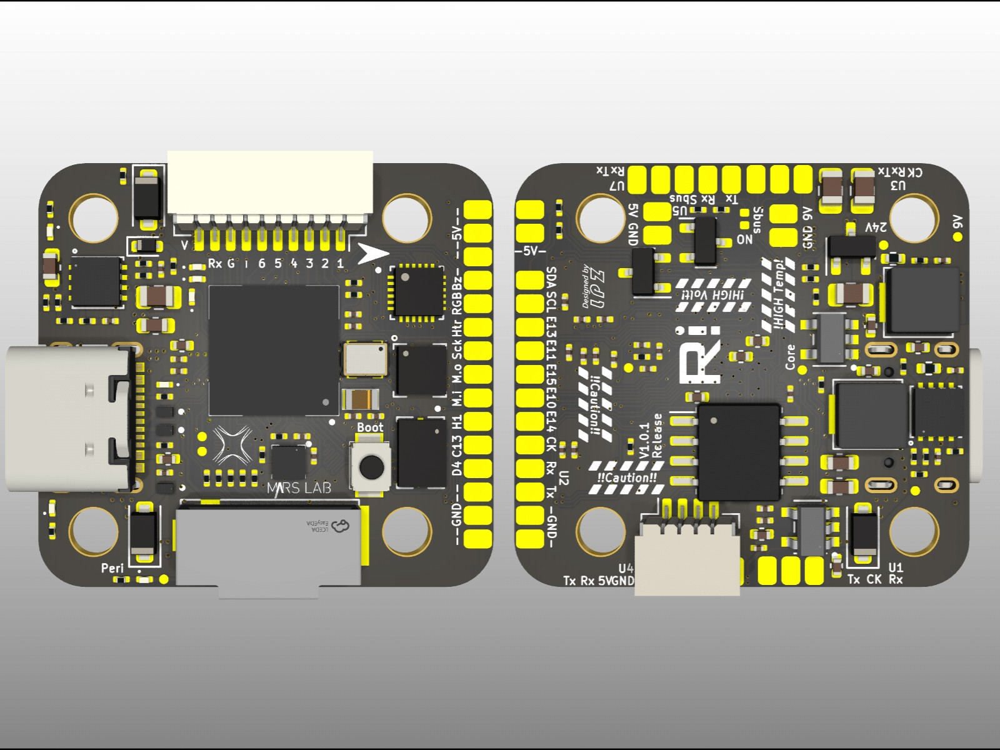
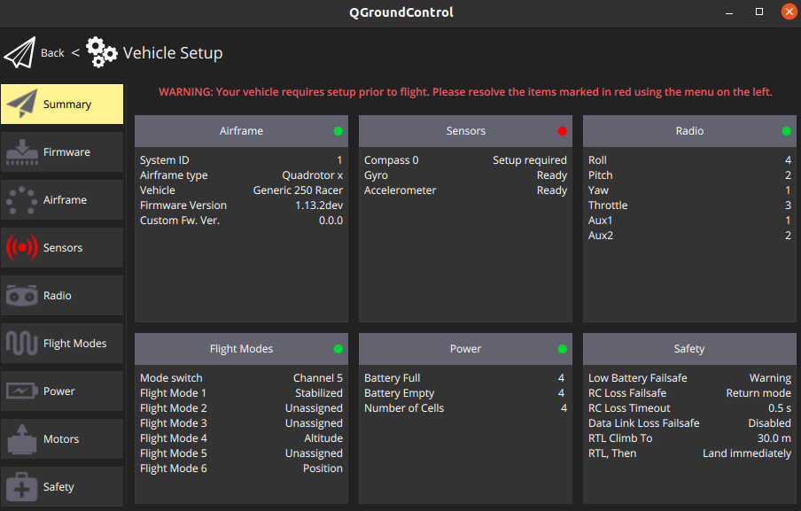
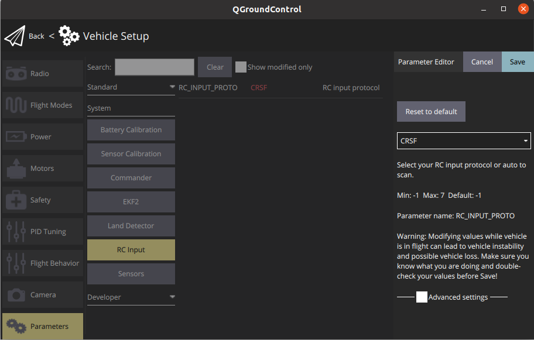
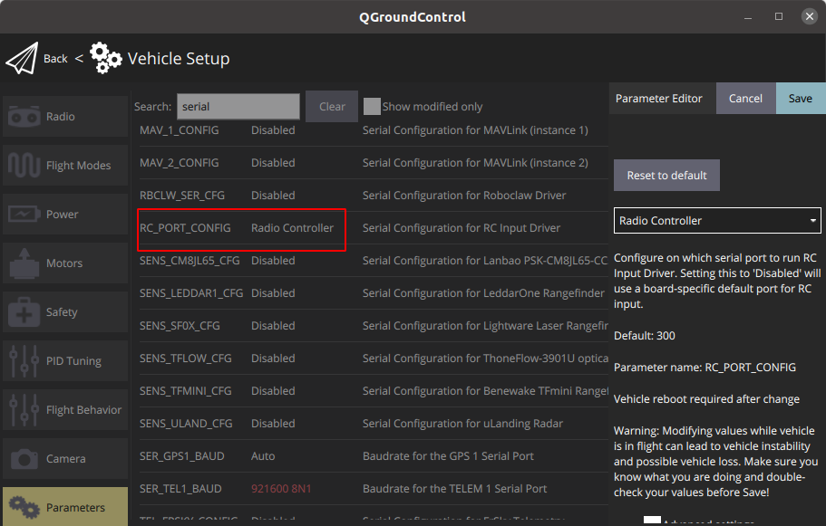
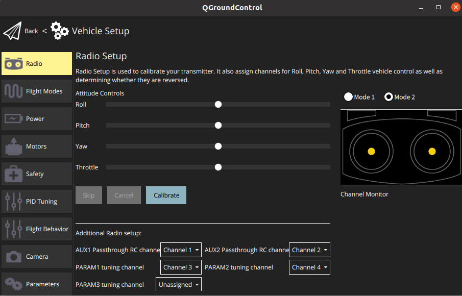

# NxtPX4

> All GPIO & function small size PX4 for UAV research for HKUST UAV-Group

* Dimension of NxtPX4: 27mmx29mmx8mm

# Getting start

1. clone repo using:     `git@github.com:HKUST-Aerial-Robotics/NxtPX4.git`
2. run init repo script:     `./init_all_repo.sh`
   it will take some time to clone all submodules into loccal
3. Enter directory **NxtPX4-Hardware**:     `cd ./NxtPX4-Hardware`
   you should notice that you are not on main branch, So Checkout to main branch using:  `git checkout -b main`
4. cd back to NXTPX4 dir
5. Enter directory **PX4-Autopilot**:   `cd ./PX4-Autopilot`
   you should notice that you are not on main branch or develop branch. So checkout main branch to local and then checkout to develop branch to compile frameware for NxtPX4.
   `git checkout -b main` and then `git checkout -b develop origin/develop`
6. configure done !

## Hardware development

* Kicad 7.0 required
* Create new branch for your own features
* Only general hardware features can be merged into main branch

### Caution!!!!!!!!

in v1.0.1 design, the original idea is to make ESC connector order weird, to make user notice the PINOUT sequence, however in practice, Rx pin is too close to Vbat pin, which leads to MCU damage at the moment power on or off if the cable is not titely installed.  Noticing that, in v1.1.0 design, we change the ESC pinout order.

~~To avoid burning the LDO module of NxtPX4 due to the large current generated by the 6S RC-Battery at power-on, we strongly recommend connecting the NxtPX4 flight controller to the ESC first, and then powering on the ESC to activate the NxtPX4. In previous power tests, there were multiple instances of LDO module burnout on the NxtPX4 flight controller due to directly connecting/disconnecting it with an already powered ESC. It should be noted that due to the small size of the NxtPX4, replacing the LDO module can be a challenging task.~~

## Frameware development

### Compile

#### Local compilation

* Frameware compile: make hkust_nxt
* bootloader compile: make hkust_nxt_bootloader

#### Containerized compilation (recommended)

* Frameware compile: start_docker.sh hkust_nxt
* bootloader compile: start_docker.sh hkust_nxt_bootloader

### Develop

* Create new branch named as **feature-xxx(feature info)** from **develop** branch to start your own feature development
* After test your own feature, mereged into develop branch and push a pull request (only general features will be accepted)

update repo using script: `./update_all_repo.sh`

### DevOps

| Workflow\Branch          | main                                                         |
| ------------------------ | ------------------------------------------------------------ |
| PX4-Autopilot(hkust_nxt) |  |

### hardware quick start

1. use QGroundControl connect to the uav

2. enter para ->System->RC Input  and **choose corresponding protocol**

3. serial map

Search：serial ,**RC_PORT_CONFIG**, choose corresponding port

4. radio setup

