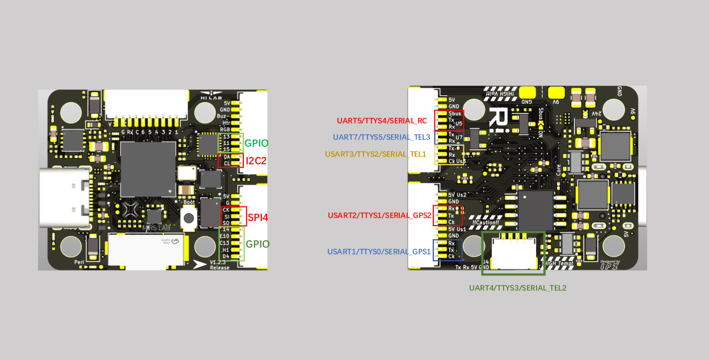
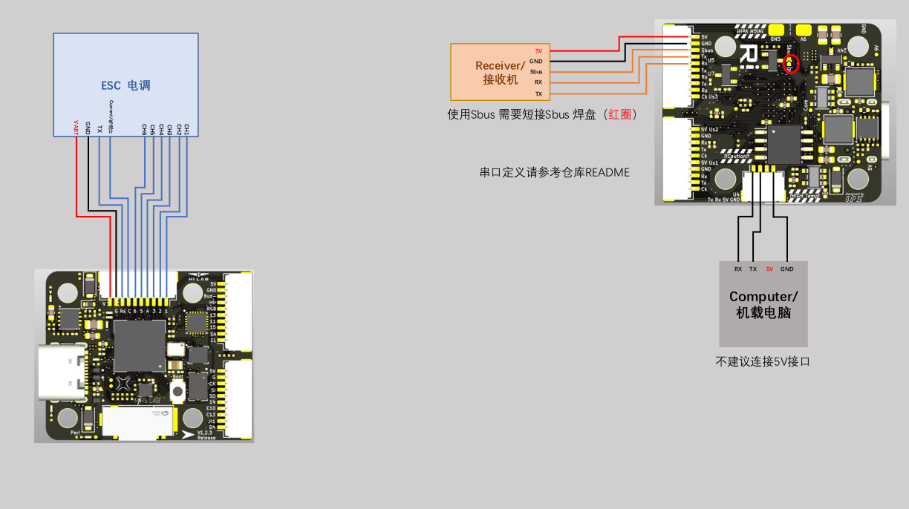

# NxtPX4


> All GPIO & function small size PX4 for UAV research for HKUST UAV-Group

Dimension of NxtPX4: 27mmx32mmx8mm

Hardware quick review

| UART   | TTY             | SerialName       | Suggest Funcion                                                                      |
| ------ | --------------- | ---------------- | ------------------------------------------------------------------------------------ |
| USART1 | /dev/ttyS0      | SERIAL_GPS1      | AUX                                                                                  |
| USART2 | /dev/ttyS1      | SERIAL_GPS2      | AUX                                                                                  |
| USART3 | ~~/dev/ttyS2~~ | ~~SERIAL_TEL1~~ | ~~ESC report~~ (**not recommend to use because it serves as debug console**) |
| UART4  | /dev/ttyS3      | SERIAL_TEL2      | Connect with offboard computer                                                       |
| UART5  | /dev/ttyS4      | SERIAL_RC        | Receiver                                                                             |
| UART7  | /dev/ttyS5      | SERIAL_TEL3      | AUX                                                                                  |

# Getting start

1. clone repo.
2. run init repo script:  `./init_all_repo.sh`
   it will take some time to clone all submodules into loccal
3. Enter directory **NxtPX4-Hardware**:     `cd ./NxtPX4-Hardware`
   you should notice that you are not on main branch, So Checkout to main branch using:  `git checkout -b main`
4. cd back to NXTPX4 dir
5. Enter directory **PX4-Autopilot**:   `cd ./PX4-Autopilot`
   you should notice that you are not on main branch or develop branch. So checkout main branch to local and then checkout to develop branch to compile frameware for NxtPX4.
   `git checkout -b main` and then `git checkout -b develop origin/develop`
6. configure done !

## Setting up NxtPX4



---

Basic connection with receiver & ESC & computer



If your receiver uses Sbus please connect the pads in red circle

### Compile PX4Firmware

#### Using make

1. go to PX4-Autoplilot directory
2. using ` make hkust_nxt_bootloader` to compile bootloader
3. Press boot button on board and then connect it with computer, flash bootloader with Betaflight configurator or STM32programmer
4. using `make hkust_nxt` to compile firmware, and flash `.px4` through QGC

#### Using Docker

1. compile firmware ` ./start_docker.sh hkust_nxt`
2. compile bootloader ` ./start_docker.sh hkust_nxt_bootloader`

### PX4 Configuration settings

#### Power

Set power_source  **Power Module**, then calibrate voltage and current analog data


#### Receiver

Set **RC_PORT_CONFIG** with **Radio controller**


#### MAVLink

Set **MAV_0_CONFIG** with **TELEM 2**


#### HIGH_RES_IMU and High frequency /imu/data

create file in your tf-card  /etc/extras.txt

```txt
mavlink stream -d /dev/ttyS3 -s ATTITUDE -r 200

mavlink stream -d /dev/ttyS3 -s HIGHRES_IMU -r 1000
```

then using the following settings

IMU_GYRO_RATEMAX: 2000Hz

IMU_INTEG_RATE: 400Hz

MAV_0_MODE: External vision

Set Uart4 to 921600

MAV_0_RATE 92160B/s

**after these settings you will have approximate 500Hz /imu/data_raw /imu/data**

if you want to have presice 500Hz imu/data_raw and 200Hz imu/data

SYS_MC_EST_GROUP: Q attitude estimator

---

## Hardware development

* Kicad 7.0 required
* Create new branch for your own features
* Only general hardware features can be merged into main branch

### Caution!!!!!!!!

in v1.0.1 design, the original idea is to make ESC connector order weird, to make user notice the PINOUT sequence, however in practice, Rx pin is too close to Vbat pin, which leads to MCU damage at the moment power on or off if the cable is not titely installed.  Noticing that, in v1.1.0 design, we change the ESC pinout order.

## Frameware development

### Pre-build firmware and bootloader

The pre-build firware and bootloader are in  `./firmware` dir, donwload and flash in corresponding with your hardware version

### Compile

#### Local compilation

* Frameware compile: make hkust_nxt
* bootloader compile: make hkust_nxt_bootloader

#### Containerized compilation (recommended)

* Frameware compile: start_docker.sh hkust_nxt
* bootloader compile: start_docker.sh hkust_nxt_bootloader

### Develop

* Create new branch named as **feature-xxx(feature info)** from **develop** branch to start your own feature development
* After test your own feature, mereged into develop branch and push a pull request (only general features will be accepted)

update repo using script: `./update_all_repo.sh`

## TODO

- [ ] ~~Develop branch back to normal HIGHRES_IMU~~
- [ ] remove MPU6500
- [ ] ~~replace 0420 Inductor with 05xx inductor~~
- [ ] refine pinout (v2.0 hardware)

## Troubleshooting

TODO

1. ESC RPM report cannot run with MAVRos /mavros/imu/data
